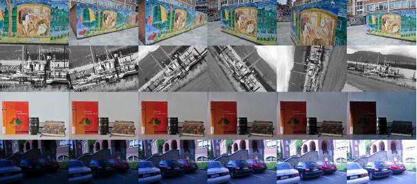
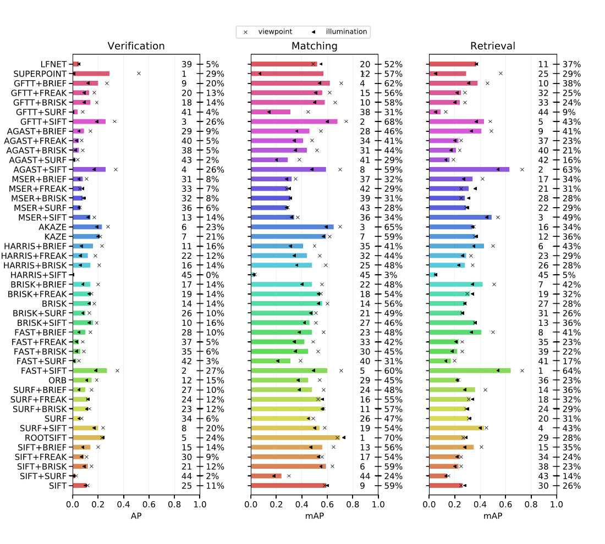

## Detector-descriptor benchmark

This is a benchmark for evaluation of state-of-the-art detector and descriptor algorithms. The details about the benchmark will soon be published as a paper.

### HPSequences dataset

Download dataset: [HPSequences dataset](http://icvl.ee.ic.ac.uk/vbalnt/hpatches/hpatches-sequences-release.tar.gz) [1.3GB]

Place the directory in a convenient location. The folder `hpatches-sequences-release` contains all the 116 directories, 57 of which represent  only  photometric  changes,  whereas 59 represent only geometric deformations. Each sequence consists of one reference image and 5 target images representing the appropriate illumination or viewpoint changes. Alongisde every target image there is a homography connecting it to the reference image (stored in files `H_1_<seq_num>`). In case of an illumination change  sequence,  the  homography  is  an  identity  mapping.

The sequence folders are named with the following convention:

* `i_X`: image sequences with illumination changes
* `v_X`: image sequences with viewpoint changes

### Results

### Remarks

This benchmark is based on the HPatches evaluation tasks [[1]](#refs) and HPSequences dataset published along with it ([HPatches dataset repository](https://github.com/hpatches/hpatches-dataset)). Thanks to the authors for providing the dataset and the evaluation details.

### References

[1] *HPatches: A benchmark and evaluation of handcrafted and learned local descriptors*, Vassileios Balntas*, Karel Lenc*, Andrea Vedaldi and Krystian Mikolajczyk, CVPR 2017.
*Authors contributed equally.
